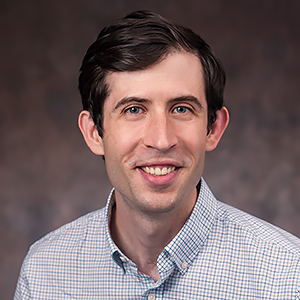

Hello! My name is David and I'm an assistant professor in the Department of Mathematics and Statistics at American University. I recently finished a postdoctoral scholarship at the University of Chicago, working under [Matthew Stephens](https://stephenslab.uchicago.edu/), where I studied hierarchical modeling approaches to analyzing sequencing data. I obtained my Ph.D. in Statistics at the University of Washington under [Peter Hoff](https://pdhoff.github.io/). My graduate work was on the statistical analysis of tensor data. If you want to see any code associated with my research, check out my [GitHub](https://github.com/dcgerard) page.

Here is a fancy picture of me:

